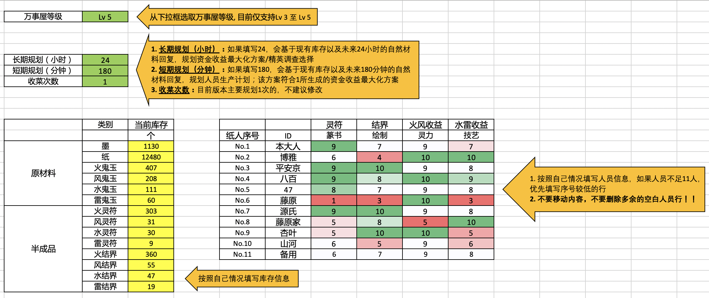

# YYS-optimization
_夏之蝉 -涉江采芙蓉- 参上_
 
阴阳师是我自己很喜欢的手机游戏，最近出了一个新活动————**阴阳师万事屋**，为了收益最大化，就基于Python用gurobi写了一个优化。

## 具体功能
- 生成长期经营规划 (短至几小时，多达几天，考虑自然恢复，规划时间大于等于24h时，会粗略按9h的回复考虑普通调查)
> 目前可选：1. 单纯考虑资金收益；2.不加速能做完的情况下，资金收益最大化
- 生成短期经营规划（适合未来几小时只想收一次或者几次菜，不想调整纸人设置的小伙伴）
- 计算最优精英调查选择（**注意**输入合适的长期规划时间，比如**24h!**）

## **使用前提：安装 Python** 
- 如果没有安装 Python 的小伙伴就不建议用了，因为步骤可能过于繁琐
- 需要的包: numpy, pandas, xlrd, xlsxwriter 和 gurobi，除了 gurobi，其他都可以通过 ```pip``` 指令安装
```
pip install numpy
pip install pandas
pip install xlrd
pip install xlsxwriter
```

## Step 1: 安装 Gurobi
1. 前往 https://www.gurobi.com/downloads/gurobi-software/ ，注册后(账户类型选Academic，邮件会有几分钟延迟)，选择合适版本的 Gurobi Optimizer 并安装
> 有Anaconda的可以直接在Anaconda prompt(Windows)或者终端(Linux)安装：  
```
conda install -c http://conda.anaconda.org/gurobi gurobi
```  
建议安装在默认文件夹或者 gurobi 程序所在的文件夹 ```Library/gurobi902/```，且所有都填yes

2. 前往 http://www.gurobi.com/downloads/user/licenses/free-academic ，申请免费学术许可证（free academic license）
> **注意：只有在获得并使用了许可证后，才可以使用gurobi！！！**
3. 下载许可证文件，并在终端内运行以下指令，**请把示例中的许可证换成你个人的许可证**

```
grbgetkey ae36ac20-16e6-acd2-f242-4da6e765fa0a
```

4. 前往gurobi程序所在的文件夹中有setup.py的那个,并输入```python setup.py install```，示例为Mac
```
cd /                           # change directory to the root directory
cd Library/gurobi902/mac64     # go to directory with setup.py
python setup.py install        # install gurobi in python environment
```

## Step 2: 下载并填写 Input.xlsx
- **注意：不要直接移动单元格！不要直接移动单元格！不要直接移动单元格！**



## Step 3: 计算优化方案/最优精英调查选择
### **生成长期 & 短期经营计划**
1. 下载 YYS.py,并与 Input.xlsx 放在同一个文件夹中
> 单纯考虑资金收益使用 YYS.py  
希望在不加速能做完的情况下，考虑资金收益最大化,使用 YYS_time.py

2. 打开终端，并进入文件所在文件夹

```
cd Downloads/YYS-optimization
```

3. 运行优化程序，如果 Input.xlsx 被改名了，记得相应调整指令哦

```
python YYS.py Input.xlsx            #适合不介意用勾玉冲的鼠，单纯考虑资金收益
python YYS_time.py Input.xlsx       #适合希望在不加速能做完的情况下、考虑资金收益最大化的鼠
```

### **生成精英调查最优解**
1. 下载 choice.py,并与 Input.xlsx 放在同一个文件夹中
2. 打开终端，并进入文件所在文件夹

```
cd Downloads/YYS-optimization
```

3. 运行优化程序，如果 Input.xlsx 被改名了，记得相应调整指令哦

```
python choice.py Input.xlsx Number_of_simulations(Optional)
```

> 示例： ```python choice.py Input.xlsx 40```  
这里默认是按不同选择，每种做100次模拟,如果不想改变模拟次数，直接运行以下指令就可以了：

```
python choice.py Input.xlsx        #目前版本仅考虑资金收益，不考虑所需时间
```


## Step 4: 理解优化方案/精英调查选择
### **生成长期 & 短期经营计划**
1. 生成的文件 **优化方案.xlsx** 中一共有四张工作表：summary，短期计划，制造安排，委派安排
2. **summary**：关于长期计划可获得经验及资金的数据总结
3. **短期计划**：每位小纸人下一步应该制造什么，以及在输入的短期规划时间内，能制造多少  
4. **制造安排**：在输入的长期规划时间内，对于每种半成品，应制造多少个
5. **委派安排**：在输入的长期规划时间内，对于每种委派，应做多少个

### **计算精英调查选择**
1. 生成的文件 **精英调查.xlsx** 中一共有四张工作表：summary，平均资金收益增长，制造安排，委派安排
2. **summary**：最优精英调查选择是什么，该选择可获得的平均资金收益增长
3. **平均资金收益增长**：基于不同精英调查选择，可获得的平均资金收益增长   
4. **制造安排 & 委派安排**：如果按最优选择来做精英调查，可能带来的制造/委派方案的改变（用于直观展示，并不代表真实结果）
> 做完调查后，如果想知道应如何更改制造/委派计划，请使用更新后的数据重新生成**优化方案**
